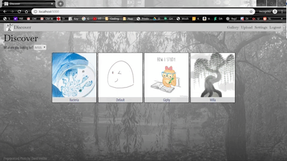
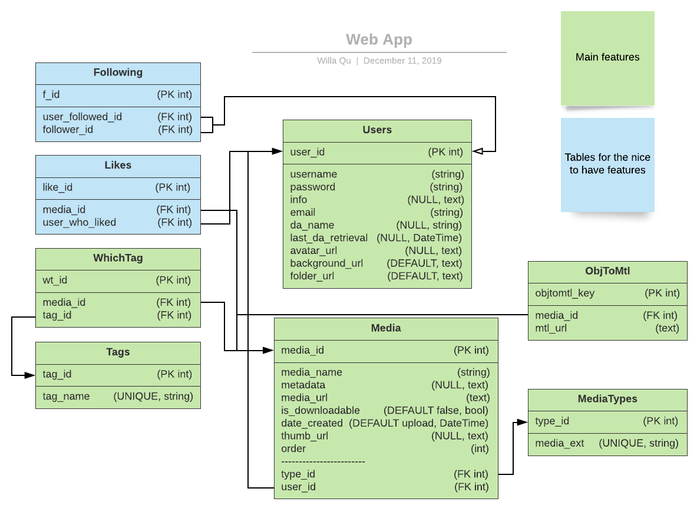

# ObjectViewGallery
#### Developed by: [Willa Qu](https://www.linkedin.com/in/michelle-willa-qu/)
 

Inspired by DeviantArt, Sketchfab, and ArtStation, this website allows users to upload 2D and 3D art to their gallery and dynamically reorder their pieces by dragging them around. The gallery page will showcase the 2D art as is and the 3D art rotating around its center axis. Otherwise, the users can add thumbnails which will take the place of their art on the gallery page. On an art’s individual page, 3D art will have controls for the user to examine the details and 2D art will have a generated theme based on the colors of the piece.

 

Tech Stack: AJAX, Flask, Javascript, Jinja, JQuery, PostgreSQL, Python, ReactJS, React-DnD, ThreeJS

API: VibrantJS

### Table of Contents
1. [Discover](#discover)
2. [Forms](#forms)
    * [regex](#regex)
    * [Event handlers to show/hide form components](#formComponents)
    * [AJAX requests and promises](#promises)
3. [A Media's Page](#mediapage)
    * [ThreeJS](#three-basic)
    * [VibrantJS](#vibrant)
4. [Gallery](#gallery)
    * [React and React-DnD](#draganddrop)
    * [ThreeJS Virtual Canvases](#three-gallery)
5. [Behind the Scenes - the Data Model](#datamodel)
6. [Installation](#installation)

### Discover 

This is the homepage of the website and shows all the artists, sorted alphabetically. Clicking on one of the artists' avatars will bring you to their gallery page.

### Forms 
My forms
#### Ajax and Promises 

### The Data Model 

A look at my database that is implemented with Flask-SQLAlchemy (dependent on SQLAlchemy and psycopg2) and PostgreSQL.
