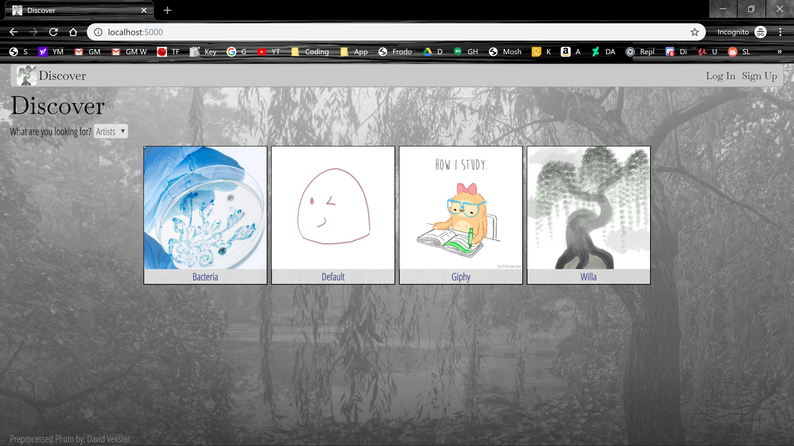
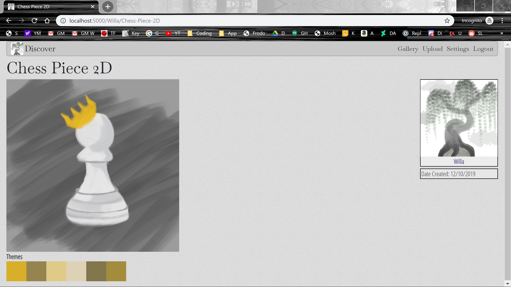

# ObjectViewGallery
#### Developed by: [Willa Qu](https://www.linkedin.com/in/michelle-willa-qu/)
<br>
<div>Inspired by DeviantArt, Sketchfab, and ArtStation, this website allows users to upload 2D and 3D art to their gallery and dynamically reorder their pieces by dragging them around. The gallery page will showcase the 2D art as is and the 3D art rotating around its center axis. Otherwise, the users can add thumbnails which will take the place of their art on the gallery page. On an art’s individual page, 3D art will have controls for the user to examine the details and 2D art will have a generated theme based on the colors of the piece.</div>

### Table of Contents
1. [Discover](#discover)
2. [An Art's Page](#mediapage)
    * [3D](#three-basic)
    * [2D](#vibrant)
3. [Gallery](#gallery)
    * [React and React-DnD](#draganddrop)
    * [ThreeJS Virtual Canvases](#three-gallery)
4. [Form Validation and Events](#forms)
    * [Regex, AJAX requests, promises](#validation)
    * [Event handlers](#formComponents)
5. [Behind the Scenes - the Data Model](#datamodel)
6. [What I Used](#tech)
7. [Installation](#install)


### Discover <a name="discover"></a>

<br>
This is the homepage of the website and shows all the artists, sorted alphabetically. Clicking on one of the artists' avatars will bring you to their gallery page.

### An Art's Page <a name="mediapage"></a>
Each uploaded art will have its own page that contains more detailed information about it (descriptions, tags, and the date of creation).
#### 3D <a name="three-basic"></a>

3D models are rendered using ThreeJS with controls to move the object in 3D space.
#### 2D <a name="vibrant"></a>

2D art is displayed with its correct aspect ratio and with a theme of colors (produced by running the image through the VibrantJS API). This palette is present to inspire and describe the feeling of the art.

### Gallery

A gallery page hosts the entirety of an artist's art. In edit mode, the user can drag their art around to dynamically reorder what is seen first. Outside edit mode, a click on any piece of art will lead to an individual art's page.
#### React and React-DnD <a name="draganddrop"></a>
The entire gallery page is created in React and the React-DnD library adds utilities to implement drag and drop (this is built on top of the HTML5 drag and drop API). I have three internal React components (one for 2D art and two for the different 3D art formats) wrapped by a large React component. Each internal component is draggable and can be dropped onto any of the other internal components. The reordering occurs when the dragged art is hovering over another art for increased responsiveness (avoids the flickering effect that occurs when items are reordered on drop).
#### ThreeJS Virtual Canvases <a name="three-gallery"></a>
Browsers can only have up to 8 WebGL contexts rendering at one time. Not only will the WebGL renderers start lagging but any additional renderers will cause the browser to forget about the oldest one. Thus, I created one large canvas that is displayed with one renderer (called once by React during the mounting phase). Each 3D model practically has its own virtual canvas since its location is dependent on an HTML div element. As the div is moved around through drag and drop, the 3D model's location shifts in the next renderer loop.

### Form Validation and Events <a name="forms"></a>
A look at some of my forms which have extra form validation on the Javascript side:

#### Regex, Ajax, and Promises <a name="promises"></a>
Some fields are checked every time the user types, such as the username, while other fields, liike the passwords, are checked everytime the form is submitted. I have also created custom error messages that will tell the user what the error is.
#### Event handlers <a name="formComponents"></a>
With jQuery, I added event handlers to my forms to show/hide and disable/require different parts of the form. This was something I wanted to do especially for the Upload form since there are distinct files I would need to ask the user to upload depending on the art file format (for example, optional .mtl files for .obj 3D objects and .bin files for .gltf 3D objects).

### The Data Model <a name="datamodel"></a>

A look at my database that is implemented with PostgreSQL and Flask-SQLAlchemy (dependent on SQLAlchemy and psycopg2). I ended up having enough time to implement the Following table from the Nice to Have features.

### What I Used <a name="tech"></a>
* Tech Stack: AJAX, Flask, Javascript, Jinja, JQuery, PostgreSQL, Python, ReactJS, React-DnD, ThreeJS
* API: VibrantJS

### Installation <a name="install"></a>
```
$ git clone https://github.com/MichelleWillaQu/ObjectViewGallery-Art-Showcase.git
$ virtualenv env
$ source env/bin/activate
$ pip install -r requirements.txt
$ createdb showcase
$ python3 seed.py
$ vim secrets.sh
  >i
  >export SECRET_KEY='mysecrets'
  >:wq
$ source secrets.sh
```
The code above clones my repository, creates a virtual environment (so any installations do not propagate to the global environment), activates a virtual environment, installs the python and backend requirements, creates a PostgreSQL database called 'showcase', creates the starting information for the database, creates a file called 'secrets.sh' that holds a variable called SECRET_KEY for Flask, and, finally, exports the secrets.sh variable to the local environment for Flask to grab.
<br><br>
Then to run the website,
```
$ python3 server.py
```
